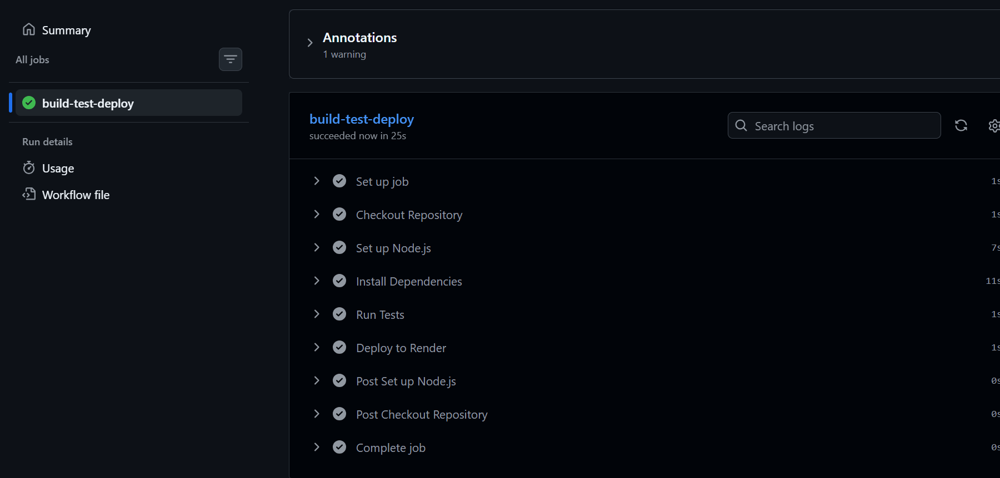
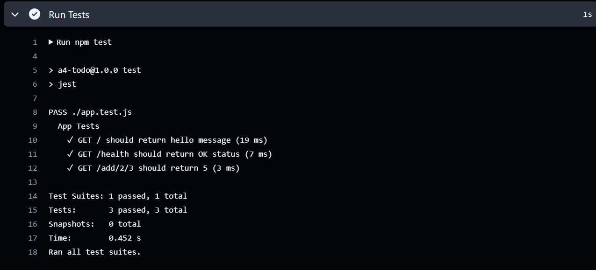
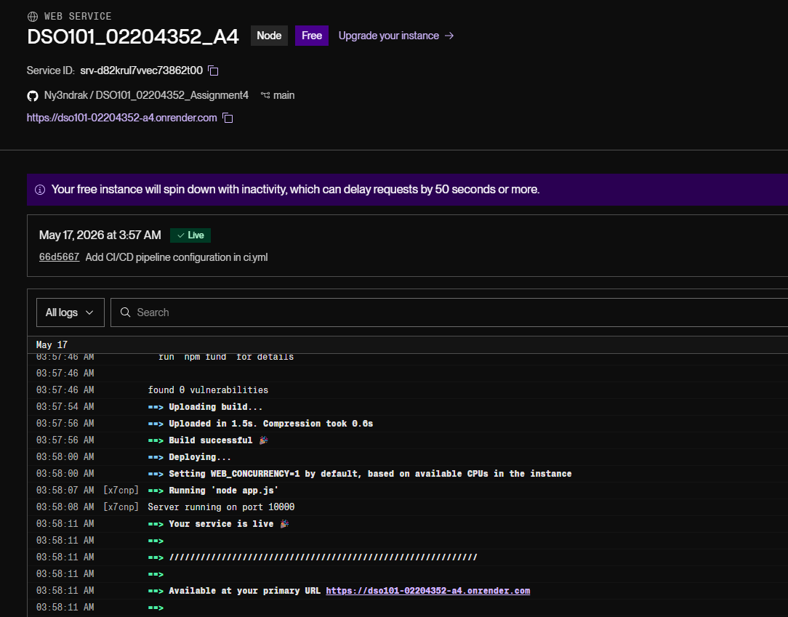
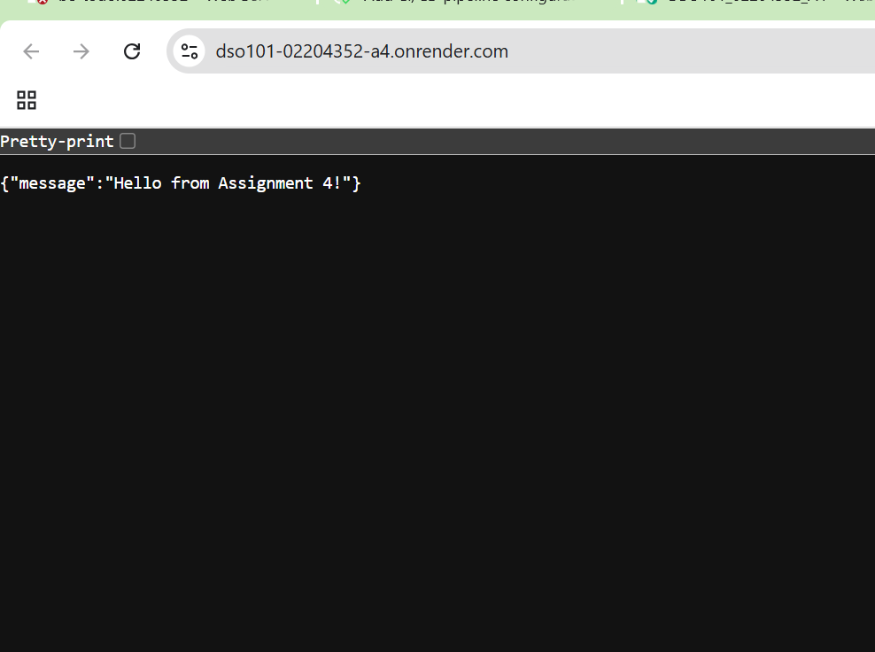

# Assignment 4 — Complete CI/CD Pipeline with Testing & Deployment
**Student:** Nyendrak Yoezer Zangmo  
**Student ID:** 02240352  
**Course:** DSO101 — Continuous Integration and Continuous Deployment  
**Date of Submission:** 13th May  

---

## Overview

This assignment implements a complete CI/CD pipeline using GitHub Actions for a Node.js (Express) backend application. The pipeline automatically builds, tests, and deploys the application to Render.com on every push to the `main` branch.

---

## Tools & Technologies

| Tool | Purpose |
|---|---|
| GitHub | Hosting source code |
| GitHub Actions | CI/CD automation |
| Node.js & Express | Backend runtime & framework |
| Jest & Supertest | Unit testing |
| Render.com | Cloud deployment |

---

## Project Structure

```
nyendrak_02240352_DSO101_A4/
├── .github/
│   └── workflows/
│       └── ci.yml          # GitHub Actions CI/CD workflow
├── app.js                  # Main Express application
├── app.test.js             # Jest unit tests
├── package.json            # Node.js dependencies & scripts
└── README.md
```

---

## Steps Taken

### Step 1 — Created GitHub Repository
- Created a new public repository named `nyendrak_02240352_DSO101_A4` on GitHub

### Step 2 — Built the Backend App
Created `app.js` with three endpoints:
- `GET /` — returns a hello message
- `GET /health` — returns app health status
- `GET /add/:a/:b` — adds two numbers and returns the result

### Step 3 — Wrote Unit Tests
Created `app.test.js` with 3 tests using Jest and Supertest:
- Tests the home route response
- Tests the health check endpoint
- Tests the addition endpoint with values 2 + 3 = 5

### Step 4 — Created CI/CD Workflow
Created `.github/workflows/ci.yml` to automate:
1. Checking out the repository
2. Setting up Node.js 18
3. Installing dependencies
4. Running all tests
5. Triggering Render deployment via webhook

### Step 5 — Deployed to Render
- Created a new Web Service on Render connected to the GitHub repo
- Set build command to `npm install` and start command to `node app.js`
- Added the Render Deploy Hook URL as a GitHub Secret (`RENDER_DEPLOY_WEBHOOK`)

---

## Application Endpoints

| Endpoint | Method | Response |
|---|---|---|
| `/` | GET | `{ "message": "Hello from Assignment 4!" }` |
| `/health` | GET | `{ "status": "OK" }` |
| `/add/:a/:b` | GET | `{ "result": number }` |

---

## CI/CD Workflow (ci.yml)

```yaml
name: CI/CD Pipeline

on:
  push:
    branches: ["main"]

jobs:
  build-test-deploy:
    runs-on: ubuntu-latest

    steps:
      - name: Checkout Repository
        uses: actions/checkout@v3

      - name: Set up Node.js
        uses: actions/setup-node@v3
        with:
          node-version: "18"

      - name: Install Dependencies
        run: npm install

      - name: Run Tests
        run: npm test

      - name: Deploy to Render
        run: |
          curl -X POST ${{ secrets.RENDER_DEPLOY_WEBHOOK }}
```

---

## Screenshots

### 1. GitHub Actions — Successful Workflow


---

### 2. Test Output

> ```
> PASS ./app.test.js
>   App Tests
>     ✓ GET / should return hello message
>     ✓ GET /health should return OK status
>     ✓ GET /add/2/3 should return 5
> Tests: 3 passed, 3 total
> ```

---

### 3. Render.com — Successful Deployment


---

### 4. Live Application Running


---

## Live Application URL

🔗 **https://dso101-02204352-a4.onrender.com**

---

## Challenges Faced

1. **curl: no URL specified error** — The `RENDER_DEPLOY_WEBHOOK` GitHub secret was empty. Fixed by getting the Deploy Hook URL from Render service settings and adding it as a GitHub secret.

2. **Tests not found** — Jest couldn't find the test file because `supertest` was not installed. Fixed by adding `supertest` to `devDependencies` in `package.json` and running `npm install`.

3. **Port conflict on Render** — The app was hardcoded to port 3000. Fixed by using `process.env.PORT || 3000` so Render can assign its own port dynamically.

---

## Learning Outcomes

- Learned how to build a simple REST API with Node.js and Express
- Learned how to write unit tests using Jest and Supertest
- Understood how to set up a full CI/CD pipeline with GitHub Actions
- Learned how to automatically trigger Render deployments using a webhook
- Understood the importance of using GitHub Secrets to protect sensitive credentials
- Gained experience deploying a Node.js app to Render.com

---  